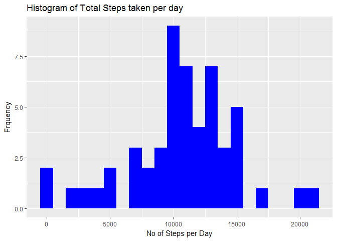

R Markdown document for the Assigmnet
-------------------------------------

### Step 1 : Load & preprocess data

    knitr::opts_chunk$set(cache = TRUE)
    dat <- read.csv("activity.csv")
    # Turn the date data into a valid date class
    # Allows for easier processing
    # Dates are in YYYY-MM-DD format
    #dates <- strptime(dat$date, "%Y-%m-%d")
    #dat$date <- dates

### Step 2 : Histogram of the total number of steps taken each day

    # Unique dates in the data
    unique_dates <- unique(dat$date)
    #Unique intervals in the data 
    unique_int <- unique(dat$interval)
    # calculating steps per day
    steps_date <- aggregate(steps ~ date,data = dat,sum)
    #assigning column names to new data frame
    colnames(steps_date) <- c("date","steps")
    #Plotting required histogram
    ggplot(steps_date,aes(x=steps))+geom_histogram(fill = "blue",binwidth = 1000)+labs(x = "No of Steps per Day",y ="Frquency",title = "Histogram of Total Steps taken per day")

### Step 3 :Mean and median number of steps taken each day

    mean_step <- mean(steps_date$steps,na.rm = TRUE)
    median_step <- median(steps_date$steps,na.rm = TRUE)
    print(mean_step)

    ## [1] 10766.19

Mean Steps per Day : 1.076618910^{4}

Median Steps per Day : 10765

### Step4 & 5:Time series plot of the average number of steps taken per interval of 5 min

    steps_interval <- aggregate(steps ~ interval,data = dat,FUN = mean,na.rm = TRUE)

    plot(steps ~ interval,data = steps_interval,type = "l",xlab = "Time Intervals (5-minute)", ylab = "Mean number of steps taken (all Days)", main = "Average number of steps Taken at 5 minute Intervals",  col = "green")

    max_interval <- steps_interval[which.max(steps_interval$steps),]

Interval With Max Steps : 835 and No of Steps is 206.1698113

### Step6:Code to describe and show a strategy for imputing missing data

    #calculate no og missing values in dataset
    num_na_dat <-  sum(num_na <- is.na(dat$steps))
    num_na_dat

    ## [1] 2304

    #The strategy that will be used to fill in the missing values in the data set is to replace all NA values with the mean of #that particular 5-minute interval the observation falls on

    ## This function returns the mean steps for a given interval
    getMeanStepsPerInterval <- function(interval){
        steps_interval[steps_interval$interval==interval,"steps"]
        }
    #Creating  a new dataset  but with the missing data filled in
    complete_dat <-dat
    ## Filling the missing values with the mean for that 5-minute interval
    flag = 0
    for (i in 1:nrow(complete_dat)) 
            {
                if (is.na(complete_dat[i,"steps"]))
                    {
                         complete_dat[i,"steps"] <- getMeanStepsPerInterval(complete_dat[i,"interval"])
            flag = flag + 1
                    }
            }
     
    #Check if there are any more NA values in complete_dat
    num_na_comp_dat <-  sum(num_na <- is.na(complete_dat$steps))
    num_na_comp_dat

    ## [1] 0

### Step7:Histogram of the total number of steps taken each day after missing values are imputed

    # Unique dates in the data

    # calculating steps per day
    steps_date_comp <- aggregate(steps ~ date,data = complete_dat,sum)
    #assigning column names to new data frame
    colnames(steps_date_comp) <- c("date","steps")
    #Plotting required histogram
    ggplot(steps_date_comp,aes(x=steps))+geom_histogram(fill = "blue",binwidth = 1000)+labs(x = "No of Steps per Day",y ="Frquency",title = "Histogram of Total Steps taken per day")

    steps_date_comp <- aggregate(steps ~ date,data = steps_date_comp,sum)
    mean_step_comp <- mean(steps_date_comp$steps)
    median_step_comp <- median (steps_date_comp$steps)

Before Imputation : Mean Steps per Day : 1.076618910^{4} Median Steps
per Day : 10765

After Imputation : Mean Steps per Day : 1.076618910^{4} Median Steps per
Day : 1.076618910^{4}

### Step8:Panel plot comparing the average number of steps taken per 5-minute interval across weekdays and weekends

    ## Finding out weekdays and weekends from complete data set and creating a new column for day of the week

    complete_dat$days <-  weekdays(as.Date(complete_dat$date),abbreviate = FALSE)
    # Agrregating the data 

    ## Seperating out Weekday and weekend activity 
     complete_dat_weekday <- subset(complete_dat, days != c("Sunday","Saturday") )
     complete_dat_weekend <- subset(complete_dat, days == c("Sunday","Saturday") )
     
    ## Averaging out weeekday and weekend activity
     complete_dat_weekday_avg <- aggregate(steps ~ interval,complete_dat_weekday,sum)
    complete_dat_weekend_avg <- aggregate(steps ~ interval,complete_dat_weekend,sum)

    # Creating a plot of weekdat vs weekend activity  
     par(mfrow = c(2,1))

    with(complete_dat_weekday_avg,plot(interval,steps,xlab = "Interval", ylab ="Steps",type = "l",main = "Weekdays",col= "green"))
    with(complete_dat_weekend_avg,plot(interval,steps,xlab = "Interval", ylab ="Steps",type = "l",main = "Weekends", col = "blue"))

